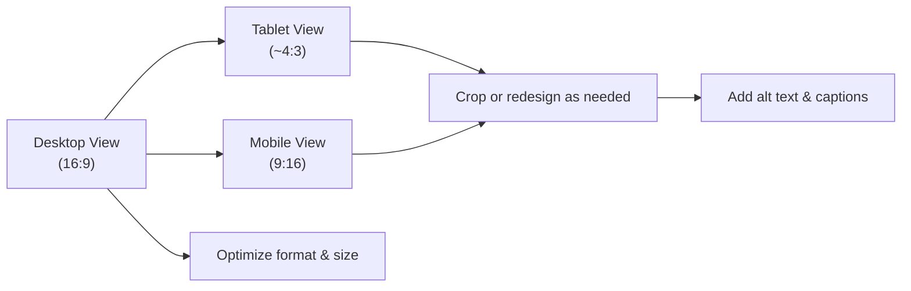

# Executive Summary

Hero images – large visuals spanning the top of a page – set the tone for a website. Best practices emphasize clear composition (often using the rule-of-thirds), a strong focal point, and ample **negative space** (areas left empty) for overlaid text. Images should reflect brand identity and message, not just generic stock photos. Clarity, simplicity and responsiveness are key: ensure the subject is obvious, text is legible against the background (sufficient color contrast), and versions are cropped or remade for different screen sizes. Load speed matters, so use modern formats (WebP/AVIF), compress images, and keep file sizes modest (ideally under ~500KB) to meet performance and Core Web Vitals. Every hero should have **descriptive alt text** per WCAG to support accessibility and SEO.

# Universal Principles for Hero Images

- **Composition & Focal Point:** Use compositional rules (e.g. rule of thirds) to place the main subject (person, product, scene) off-center. This creates a natural focal point and leaves room for text. Always include a **negative/copy-safe space** – an uncluttered area (often one third of the image) where headlines and buttons will go. A mermaid diagram illustrating a typical hero layout is below.

   *Figure: The rule-of-thirds grid guides placing a subject off-center, leaving “empty” space for text.*  

  ```mermaid
  flowchart TD
    Hero[Hero Section] --> BrandStory[Brand Identity/Story]
    Hero --> Text[Headline & Subheadline Area]
    Hero --> CTA[Call-to-Action Button]
    Hero --> Visual[Hero Visual (Image/Video/Illustration)]
    Visual --> Focal[Subject (placed on a rule-of-thirds point)]
    Visual --> Space[Negative Space for Text]
    Visual --> Contrast[High Color Contrast]
    Text --> Legibility[Readable on all devices]
    CTA --> Placement[Above the Fold, Visible]
  ```
- **Clarity & Readability:** Hero images must *support* the headline, not compete with it. Use simple, uncluttered imagery so text stands out. Avoid busy scenes; if needed, overlay a subtle dark/light gradient behind text. Ensure sufficient color contrast between text and background (WCAG recommends 4.5:1 contrast for normal text). Always keep text out of the edges to avoid cropping issues.

- **Composition Tokens:** When prompting or designing, explicitly specify composition cues: e.g. “rule-of-thirds composition,” “shallow depth of field” (to blur irrelevant background), “soft natural light,” “warm/cool color palette,” and “no text or logos”. For photography, mention camera settings (“soft focus”, “bokeh”) or angles (“high angle shot,” “wide shot”) to guide framing. For illustrations, mention style (“flat-style illustration,” “line art”). Always set the **aspect ratio** (e.g. 16:9 for desktop hero) and include any negative prompts (e.g. `--no text, --no logo`) to avoid unwanted elements.

- **Accessibility:** Include descriptive alt text for every hero image per WCAG/Section 508. Alt text should succinctly convey the image’s essential content in context (“Smiling pediatric dentist examining child patient,” not “doctor in white coat”). If the hero is purely decorative (rare in UX-optimized heroes), it may have empty alt text; otherwise, treat it as informative. For any hero video, provide captions or transcripts. Ensure keyboard focus and ARIA roles if overlays are interactive.

- **Responsiveness & Cropping:** Design hero images with mobile in mind. As HubSpot notes, mobile safe zones are tighter, so keep the subject centered or allow for a separate mobile crop. *Do not* just scale down a desktop hero; instead, plan mobile-specific composition (e.g. vertical crops or alternate visuals) so critical elements aren’t cut off. Common patterns: desktop = 16:9 or 16:10, tablet ~4:3, mobile often 9:16 (vertical). Use `srcset` or responsive images so the browser loads the right version at each breakpoint.

- **Formats & Performance:** Use modern formats (WebP/AVIF) and compress images intelligently. Aim for fast loading without visible quality loss: e.g. <500 KB if possible on 1920px width. Lazy-load below-the-fold but load the hero eagerly (it’s often largest contentful paint). Monitor Core Web Vitals – large uncompressed heroes can cause poor LCP.

- **Style & Brand Fit:** The hero should match your brand’s tone. A fun children’s brand may use illustrations or bright lifestyle photos, whereas a finance brand may use sober photography or tech graphics. Avoid clichéd or irrelevant imagery (stock photos of smiling generic people will feel disconnected). Instead, use original or customized graphics/photographs that convey your unique value proposition and brand story.

# Industry-Specific Guidance for Hero Images

Design choices depend heavily on vertical. Below are common patterns for various industries:

| **Vertical**              | **Hero Image Subjects & Style**                                                                                                              | **Considerations & Tips**                                                                                                                                                                      |
| ------------------------- | -------------------------------------------------------------------------------------------------------------------------------------------- | ---------------------------------------------------------------------------------------------------------------------------------------------------------------------------------------------- |
| **Dental / Healthcare**   | Friendly dentist or medical professional with a patient, clinic interior/exterior, or healthy smiling patient. Candid interactions are good. | Emphasize trust and comfort: warm lighting, genuine smiles, clean (but not clinical) environment. Avoid close-ups of medical tools or anything that could seem clinical or scary. Include enough background for text; for studio shots, take horizontal and vertical versions. Clothing should be neutral or branded colors; avoid bright reds or distracting patterns. |
| **Professional Services** (Legal, Consulting, Accountants) | Professional headshots, team meetings, offices, bookcases, or abstract metaphorical images (e.g. a compass, path, or city skyline).                     | Appearances should convey competence and approachability. Custom imagery is better than generic industry clichés: *“instead of a gavel, pick an image that speaks to your brand”*. Use clean, polished portraits or an illustrative style if brand-aligned. Maintain diversity and inclusivity; show people in real work contexts. Keep composition balanced (e.g. subject off to one side) so there’s room for text. |
| **Retail / E-commerce**   | The hero’s primary product or lifestyle shot. Often one clear item or person using the product, with minimal background.      | Clarity above all: *“hero images needs to be simple and clean as well as communicate clearly”*. Show the product (or related lifestyle) prominently. Use a single, static image rather than a carousel. Focus on the core selling point (best-selling item, sale, new line). Bright lighting and high contrast help products pop. Ensure any promotional text sits in the empty space, not on top of busy areas. |
| **SaaS / Tech**           | Abstract/flat illustrations (e.g. tech concept, data charts, network graphics) or clean photos of teams working on computers. | Modern SaaS brands often use custom graphics or explainer-style illustrations. Use brand colors as palette. If using photos, show team collaboration or people using the software on devices, in a bright, modern office setting. Ensure tech motifs (code, UI screens, data visuals) match product. Always leave space for headline. No real people that look too “stock” or placeholders. For more “techy” vibe, include terms like “futuristic” or “digital interface” in prompts. |
| **Hospitality / Travel**  | Scenic landscapes, cityscapes, or hotel/resort interiors with people enjoying the setting. Upscale hospitality often shows the property (pool, lobby) or destination. | Evoke experience and aspirational mood. Use warm or golden-hour lighting. Show people (relaxed, smiling) to convey service quality. Keep horizon level (architecture aligned); use tripods or corrected perspective. Avoid clutter; focus on key amenities. Include copy-safe space either on sky/skyline or on empty walls. If showing guests, attire should be smart-casual. |
| **Finance / Fintech**     | Professional office environment, people discussing charts, or financial icons/abstract overlays. Blue/green palettes are common.   | Convey stability and trust. Smiling professionals (e.g. advisors with clients), transparent offices, or even conceptual imagery (stacking coins, charts rising) can work. Ensure diversity (family-focused images for personal finance, or workspace scenes for B2B). Keep expressions confident but friendly. Avoid images of money that feel gimmicky. |
| **Education**            | Students studying, teachers teaching, campus buildings, graduates. Include diversity of gender/race/age.                            | Highlight engagement and diversity. Students collaborating at a table, professor with student, or iconic campus shot. Bright, natural light; inclusive demographics. Keep focus on learning (books, laptops, chalkboards). Avoid overly posed stock shots; candid/artful imagery performs better. |
| **B2B Manufacturing**     | Industrial equipment, engineers or technicians at work, finished products. Clean factory floors or assembly lines.                | Emphasize scale and precision. Show real (or convincingly realistic) production or equipment with people wearing safety gear (hard hats, gloves) interacting. Use high-resolution detail to convey quality. Clean up distracting clutter; align lines vertically/horizontally. Industrial palettes (steel, blue) dominate; ensure text contrast on those backgrounds. |

# Generative Prompt Templates & Patterns

To automate hero creation, we prepare text-to-image prompts. Each prompt should specify: **subject**, **style**, **composition**, **color**, **lighting**, and **aspect ratio**. Include `--no` (negative) instructions to avoid undesired elements (text, logos, trademarked products, real public figures).

Below are *copy-paste-ready* prompt examples by vertical (using a generic brand color placeholder like `#123456`). Adjust subject and colors to match each use case:

- **General Format:** `"Create a [style] hero image for a [industry] homepage. [Camera/Composition details]. Subject: [subject description]. Composition: [e.g. subject on right third, left side empty]. Lighting: [soft/natural/studio]. Color: [brand colors or mood]. Resolution: High, 16:9, no text or logos."`

**SaaS / Tech (Photography):**  
“Create a realistic photo-style hero image for a SaaS homepage. Soft natural lighting, shallow depth of field. Subject: a **confident business professional** (30s, neutral attire) working on a laptop in a modern office. Composition: **right third clear with subject**, left two-thirds empty for headline. Color palette: brand blue #0A66C2 and neutral grays. Mood: professional, approachable, high-tech. Aspect ratio 16:9, 1600×900, no text or logos.”

**SaaS / Tech (Illustration):**  
“Create a flat-style **illustration** hero image for a B2B software landing page. A digital workspace scene: simple shapes of two people at a desk with a computer. Composition: left side blank for text, right side with illustrated figures. Colors: brand blue #0A66C2, soft cream background. Minimal detail, high contrast. 1600×900, no text or logos.”

**Dental/Healthcare (Photography):**  
“Photo of a **happy dentist** (in scrubs) and a **smiling patient** in a bright dental clinic. Wide-angle, clinical camera (e.g. 35mm, f/2.0) for moderate depth of field. Composition: subject on right, clear background on left. Soft daylight from window. Palette: warm neutrals (cream, soft blue). Mood: caring, clean, trustful. 16:9, no instruments visible, no text.”

**Legal/Professional (Photography):**  
“Hero image of a **friendly business meeting**: two well-dressed lawyers or consultants (diverse individuals) talking over documents in a contemporary office. Shot at eye level, medium shot. Composition: subjects on left side, right side empty for headline. Lighting: balanced indoor light. Color: neutral (navy, grey, white). Mood: professional, confident. 16:9, high resolution, no text/logos.”

**Retail/Ecommerce (Photography):**  
“Hero image featuring a **single product in context**: e.g., a sleek white kitchen appliance on a modern kitchen countertop. Shot from a slight top-down angle. Composition: product centered or right third, left side clear. Lighting: bright, soft studio light. Background: light gray or subtle kitchen blur. Palette: product’s brand colors (e.g. red and white). Minimal, sharp, high detail. 16:9, no text.”

**Hospitality (Photography):**  
“Photograph of a **luxury hotel pool at sunset**: a tranquil scene with one or two guests lounging by the pool. Wide horizontal shot. Composition: pool and sky filling frame, guests on one side leaving sky for text. Golden-hour warm light. Colors: warm oranges/teals. Mood: relaxing, inviting. 16:9 ratio, no added graphics, subtle lens flare.” 

**Finance (Photography):**  
“Hero image for a bank website: **city skyline with office interiors**. Subject: a thoughtful professional (40s) reviewing a tablet, office skyscrapers in background. Shot through office window (framing subject partially). Composition: person on left third, skyline right. Lighting: cool midday light. Colors: blues and grays. Tone: stable, trustworthy. 16:9, no overt branding.”  

**Education (Photography):**  
“Classroom scene hero: a diverse group of college students studying together at a round table. Shot at medium distance so faces are visible. Composition: students on one side, whiteboard on the other with text blanked out (text space). Lighting: bright classroom lights. Palette: warm neutrals (wood, white, soft blues). Mood: engaged, collaborative. 16:9, no corporate logos.”  

**B2B Manufacturing (Photography):**  
“Industrial hero image: two engineers (in safety vests and helmets) inspecting a piece of machinery on a factory floor. Low-angle shot showing scale. Composition: engineers on right, machine center, left side open. Lighting: bright factory light, high clarity. Colors: steel gray, blue overalls. Technical, precise mood. 16:9, no text.” 

*(For illustrative or abstract styles, replace “Photo” with style cues like “vector graphic” or “digital painting” and describe shapes or icons instead.)*

# QA Checklist & A/B Testing Metrics

- **Legibility Check:** Ensure headline and buttons are fully visible on the hero (check all responsive breakpoints). Text should not overlap busy image parts.  
- **Contrast & Accessibility:** Verify contrast ratio ≥4.5:1 for text. Include alt text. If hero is video, add captions/transcript.  
- **Responsive Validation:** Test how the hero crops on various devices. Ideally, use separate hero assets or media queries (desktop, tablet, mobile). Confirm focal point remains on screen.  
- **Performance:** Measure hero image size and load time (LCP). Optimize using compression. Check Core Web Vitals – aim for quick LCP.  
- **User Metrics:** Run A/B tests on headline-image-CTA combinations. Track key KPIs:  
  - **Hero CTR:** Click-through rate on primary CTA in the hero.  
  - **Bounce Rate / Time on Page:** Compare visitors who see the hero.  
  - **Conversion Rate:** For visitors interacting via the hero.  
  - **Engagement:** Scroll depth or interaction.  
  - **Load Time / LCP:** Impact of hero image on page speed.  

# Good vs. Bad Hero Image Examples

- **Good Hero:** Clear subject, large negative space for text, and high contrast. (Imagine a smiling professional on one side and a blank background on the other.)  
- **Bad Hero:** Busy photo with multiple competing elements, text overlaid on a cluttered area, or subjects cut off on mobile. (For instance, a headshot too close and text cut off on smaller screens.)  

*As a rule, use the hero to **support** the headline. Overly detailed images bury the message – fix by adding whitespace or a color overlay.*  

 **Illustration:** The diagram below shows ideal layout zones in a hero section.



# Implementation & Automation Notes

- **File Naming/Metadata:** Use descriptive filenames (e.g. `hero-dental-exam-2026.webp`). Add meaningful `alt` attributes (short phrases describing the scene, per Section 508 guidelines). Include image dimensions and `srcset` for responsive loading.  
- **Cropping Presets:** Prepare design templates or AI prompts for each breakpoint. For example: desktop (1920×1080), tablet (1024×768), mobile portrait (1080×1920). Store these variants in a structured naming scheme (e.g. `hero-img-mobile.jpg`).  
- **CDN & Optimization:** Serve hero images via a CDN. Use automated tools or build processes (e.g. webpack, image optimization services) to compress and convert to WebP/AVIF. Consider lazy-loading offscreen images, but preload the hero for fastest paint.  
- **Alt & Accessibility Tags:** In HTML, the hero `` should have `alt=""` or meaningful text depending on content. If decorative background, mark it as such so screen readers skip it. Otherwise, alt text should echo the headline’s context. Use `role="img"` or `aria-label` as needed.  
- **A/B Testing Variants:** Tag multiple hero images (e.g. Hero A, B, C) in analytics. Track user interactions separately. Store variant metadata (image ID, prompt details) for analysis.  
- **Integration:** For AI pipelines, include image metadata (prompt text or tags) in CMS fields. Automate generation of alt text via captioning APIs if needed, then manually refine for clarity.  

By following these guidelines, teams can craft hero images that are visually engaging, on-brand, performant, and accessible, while maintaining consistency across industries. Remember: **the best hero images bolster the headline, not overshadow it**.

**Checklist (Quick Reference):** Headline + CTA present; clear focal point; copy-safe space; WCAG contrast; responsive crops ready; optimized files (WebP, <500 KB); descriptive alt text; A/B test variants.

