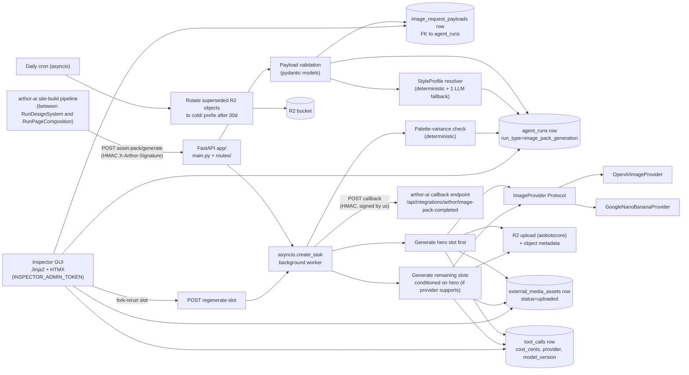

# plan.md — arthor-image-service v1

Owner: justin
Status: drafted 2026-05-17, awaiting go/no-go

This plan is the synthesis of `packet/SPEC.md` + `scratch/intake-notes.md` + the 12 `scratch/research/*.md` reports. ADRs in `plan/adr/` lock the non-obvious decisions. Slice candidates at the bottom are refined by `slice-to-tasks` after approval.

## Approach (one paragraph)

Build a FastAPI service that mirrors arthor-agent's app shape (`app/` layout, `pydantic-settings`, `asyncpg`, `RuntimeServices` on `app.state`, `asyncio.create_task` background work). Authenticate inbound traffic from arthor-ai via HMAC (`X-Arthor-Signature: sha256=<hex>` over raw body, `FASTAPI_ARTHOR_SHARED_SECRET`), and gate the inspector GUI with a Bearer `INSPECTOR_ADMIN_TOKEN`. Write numbered SQL migrations (`db/migrations/001_*.sql`, `002_*.sql`, …) extending the shared Neon schema with `external_media_assets` + `image_request_payloads` + three additive columns on `tool_calls` (`cost_cents`, `provider`, `model_version`); do not apply to prod (W11 owns that). Define a Python `Protocol`-shaped `ImageProvider` with `generate_single` and `generate_pack_consistent`; ship two concrete providers (OpenAI image, Google nano-banana). Resolve a single `StyleProfile` per asset-pack run and apply it to every slot prompt; persist on `agent_runs.metadata.style_profile`. Upload to R2 via `aiobotocore` with the hybrid key layout `arthor-image-service/<site_id>/<asset_id>.<ext>` plus rich object metadata. Surface everything in a Jinja2 + HTMX inspector at `/inspector/*` so Justin can view runs, fork-and-rerun individual slots with a new seed or a tweaked prompt-modifier, and judge pack consistency at a glance.

## Architecture

## Risks

| Risk | Mitigation |
|---|---|
| Two `agent_runs` shapes on one Neon DB (arthor-agent vs arthor-ai Drizzle) drift further when we write to the harness flavor. | ADR-0004 declares the harness flavor as canonical for cost rollup; W11 reconciles by porting missing columns to Drizzle. Coordinate before any prod apply. |
| Provider model identifiers churn fast (OpenAI / Gemini both ship new versions monthly). | `model_version` stamped on every `external_media_assets` row; provider abstraction lets us swap without touching the rest of the architecture. README documents pinned versions at implementation time. |
| Pack-consistency may not survive across two different providers (OpenAI image text vs Gemini photography). | Default routing pins consistency-sensitive slots (hero, section accents, cards) to one provider; OpenAI used only for text-heavy OG-style slots. Per-slot `provider_hint` overrides. |
| HMAC convention has no replay protection (matches arthor-agent today). | ADR-0006 documents this as a known gap inherited from the existing pattern; surfacing a follow-up issue post-launch is the right move. |
| Quality bar is subjective — no automated test can pass AC-10. | The inspector GUI's pack-consistency grid + per-slot variant comparison is the iteration surface. Justin's verdict is the v1 acceptance signal. |
| Generated images may include faces or subjects against the brand's `do_not` list. | Style-profile resolver enforces `do_not` in every prompt; per-slot `people_policy.faces_allowed` is a required field with default `false` for YMYL industries. |
| arthor-ai site-build wiring (the new `image_pack_generation` stage in `lib/inngest/build-flow/index.ts`) is owned by another agent and not in this repo's scope. | Document the contract in `docs/skills/RunImagePack/SKILL.md` so the arthor-ai work has a concrete target. Flag the upstream dependency in the PR description. |

## Slice candidates (refined by slice-to-tasks)

Numbered to suggest dependency ordering; final dependency graph lives in `slices/README.md`.

| ID | Title | Depends on | Size |
|---|---|---|---|
| s01-skeleton | FastAPI app skeleton + `app/config.py` + `app/runtime.py` + `pyproject.toml` + pytest harness + `system.yaml` + `AGENTS.md` + `README.md` + `docs/migrations.md` | — | M |
| s02-db-pool-and-migrations-001 | `db/pool.py` (asyncpg) + `db/migrations/001_external_media_assets.sql` + `db/migrations/002_image_request_payloads.sql` + `db/migrations/003_tool_calls_cost_columns.sql` + apply checklist | s01 | M |
| s03-auth | HMAC verify middleware + `INSPECTOR_ADMIN_TOKEN` bearer middleware + signed-outbound helper for the callback | s01 | S |
| s04-payload-contract | Rich payload pydantic models (`PayloadV1` per research #12), strict validation, idempotency-key handling, `image_request_payloads` writer. **Foundational slice — every other slice depends on this contract.** | s02, s03 | L |
| s05-agent-runs-writer | `agent_runs` writer (`run_type ∈ image_pack_generation | image_slot_regenerate | image_style_preview`), `tool_calls` writer with trimmed args/result + cost rollup helper | s02 | M |
| s06-style-profile-resolver | Deterministic resolver from brand + hint + first-slot intent; persistence to `agent_runs.metadata.style_profile`; default `do_not` seed list; prompt-template versioning | s04 | M |
| s07-r2-uploader | `aiobotocore` R2 client + hybrid-key uploader (`<site_id>/<asset_id>.<ext>` + object metadata) + `external_media_assets` writer + supersession helper | s02 | M |
| s08-provider-openai | `OpenAIImageProvider` implementing `ImageProvider` Protocol + retries (one auto-retry on failure with new seed) + cost calculation | s04, s05 | M |
| s09-provider-nano-banana | `GoogleNanoBananaProvider` implementing same Protocol + pack-consistent batch call + same retry policy | s04, s05 | M |
| s10-endpoint-asset-pack | `POST /images/asset-pack/generate` accept-then-callback flow; background worker; hero-first ordering; reference conditioning per `pack.reference_policy`; deterministic palette-variance check + drift tagging; HMAC-signed callback to arthor-ai | s06, s07, s08, s09 | L |
| s11-endpoint-regenerate-slot | `POST /images/regenerate-slot` (single-slot rerun with new seed or new prompt-modifier); supersession transition | s10 | S |
| s12-endpoint-style-preview | `POST /images/style-profile/preview` (one cheap probe to sanity-check the style profile before full pack runs) | s06, s07, s08 | S |
| s13-inspector-shell | Jinja2 + HTMX inspector: `templates/base.html` + `static/htmx.min.js` + auth middleware wiring + `/inspector/runs` list (paginated) + `/inspector/runs/<id>` detail with payload + resolved style profile + per-slot prompts + assets + costs | s05, s07 | L |
| s14-inspector-iteration | Prompt-modifier text box per slot + fork-rerun button (invokes regenerate-slot) + side-by-side variants view + pack-consistency grid + soft-delete/unsupersede control | s11, s13 | M |
| s15-cost-rollup-views | Cost queries (per-run, per-day, per-site, per-provider, per-slot-type) surfaced in `/inspector/cost` | s05, s13 | S |
| s16-cold-storage-cron | Daily asyncio cron to rotate `superseded` R2 objects older than 30 days to `cold/` prefix; documented retention policy | s07 | S |

Total: 16 slices. Range S=small / M=medium / L=large per `slice-to-tasks` size guidance.

## Open questions remaining (deferred to slice-to-tasks or post-v1)

These were flagged during research and intake but do not block the plan:

1. **Two-phase emit from site-build:** style-profile preview after `RunDesignSystem` + full pack after `RunPageComposition`, vs single-phase after composition. Recommendation is two-phase (research #12); confirm with Justin during slicing.
2. **Customer-uploaded asset bytes as conditioning inputs:** privacy review needed; v1 default may be palette-only.
3. **People / YMYL global policy:** default `faces_allowed: false` for health/legal/finance industries; explicit Justin sign-off per industry.
4. **OpenAI seed exposure:** OpenAI image API may not honor user seeds. The provider returns `determinism: "best-effort"` in run metadata; deterministic re-run is approximate, not exact, for that provider.
5. **`RunImagePack` skill stub publishing:** Justin's intake answer asked us to focus on payload contract, not coordinate the arthor-ai side. We will publish a read-only `docs/skills/RunImagePack/SKILL.md` describing the contract so the arthor-ai work has a concrete target, but we don't commit code to that repo.
6. **W11 absorb timing:** prod application of our migrations is sequenced against W11; document the dependency in `docs/migrations.md` and surface in every PR until W11 lands.

## ADRs

- [0001 Language and stack](adr/0001-language-and-stack.md)
- [0002 Mirror arthor-agent FastAPI shape](adr/0002-mirror-arthor-agent-fastapi-shape.md)
- [0003 SQL migration strategy](adr/0003-sql-migration-strategy.md)
- [0004 agent_runs and tool_calls flavor + extensions](adr/0004-agent-runs-and-tool-calls.md)
- [0005 external_media_assets DDL](adr/0005-external-media-assets-ddl.md)
- [0006 HMAC auth convention](adr/0006-hmac-auth-convention.md)
- [0007 Image provider abstraction](adr/0007-image-provider-abstraction.md)
- [0008 Background-task strategy](adr/0008-background-task-strategy.md)
- [0009 Style profile lifecycle](adr/0009-style-profile-lifecycle.md)
- [0010 Payload contract v1](adr/0010-payload-contract-v1.md)
