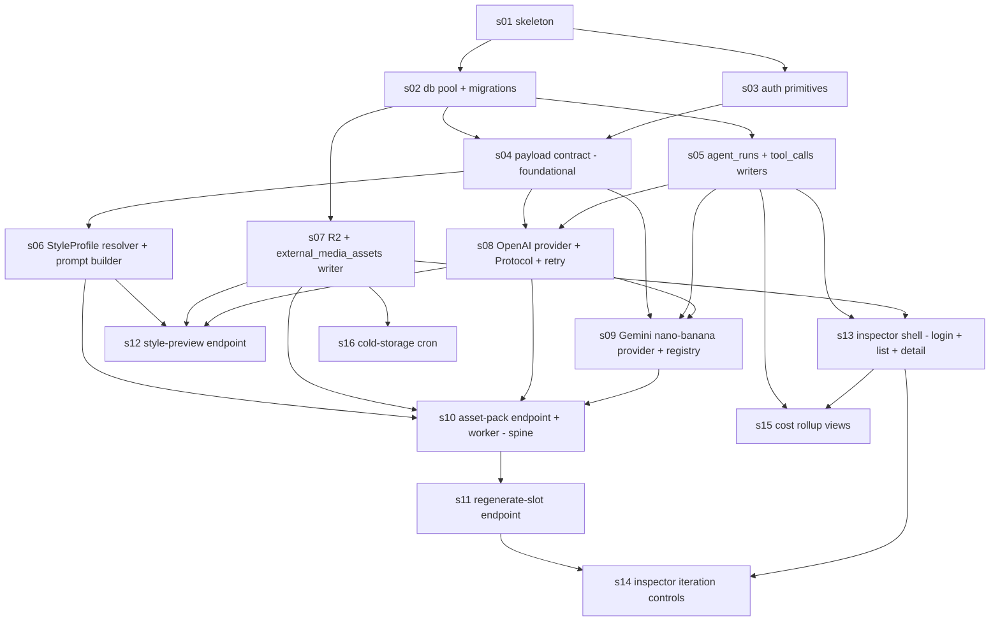
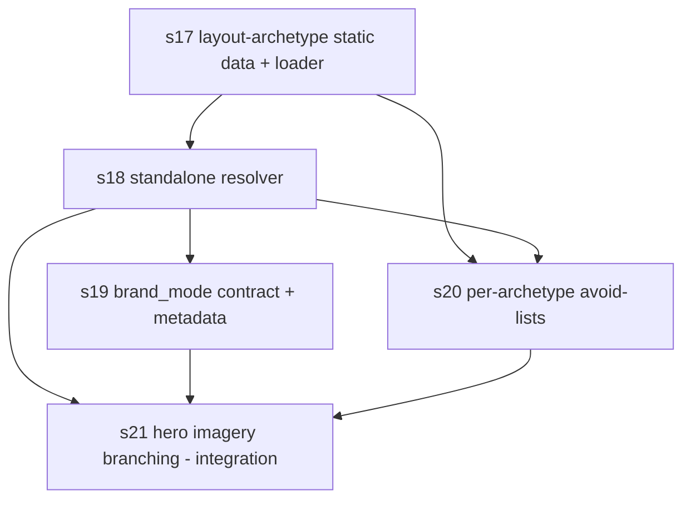

# slices/

One folder per vertical slice. Each slice is one Composer 2 subagent's worth of work. The slice contract is described in [`~/builder-os/foundation/repo/folder-contract.md`](~/builder-os/foundation/repo/folder-contract.md).

Status legend:

- `tests pending` — slice spec exists; failing tests not yet written
- `ready to dispatch` — failing tests are red and the slice can go to a Composer 2 subagent
- `in flight` — a subagent is working on it
- `green` — tests pass, awaiting structural / runtime review
- `merged` — branch landed on `main`

The user rule that every subagent prompt MUST carry verbatim:

> only change what you need to change do not completely rewrite files. always ask permission before making changes that i did not ask for directly.

Every slice's `Paths out of scope` list enforces this; subagents that touch out-of-scope files fail the slice contract.

## Index

| ID | Title | Status | Depends on | Size |
|---|---|---|---|---|
| [s01-skeleton](s01-skeleton/SPEC.md) | FastAPI app skeleton, pydantic-settings config, RuntimeServices, pytest harness, system.yaml, AGENTS.md, README | ready to dispatch | — | M (~350 LOC) |
| [s02-db-pool-and-migrations-001](s02-db-pool-and-migrations-001/SPEC.md) | asyncpg pool + the three foundational SQL migrations | ready to dispatch | s01 | M (~400 LOC) |
| [s03-auth](s03-auth/SPEC.md) | HMAC inbound verify + INSPECTOR_ADMIN_TOKEN bearer + outbound signer | ready to dispatch | s01 | S (~250 LOC) |
| [s04-payload-contract](s04-payload-contract/SPEC.md) | PayloadV1 pydantic models, strict validation, idempotency, image_request_payloads writer, JSON Schema export — **foundational** | ready to dispatch | s02, s03 | L (~700 LOC) |
| [s05-agent-runs-writer](s05-agent-runs-writer/SPEC.md) | agent_runs writer (harness flavor) + tool_calls writer + cost rollup | ready to dispatch | s02 | M (~350 LOC) |
| [s06-style-profile-resolver](s06-style-profile-resolver/SPEC.md) | Deterministic StyleProfile resolver + default do_not seed list + slot prompt builder + prompt_hash | ready to dispatch | s04 | M (~450 LOC) |
| [s07-r2-uploader](s07-r2-uploader/SPEC.md) | aiobotocore R2 client + hybrid-key uploader + external_media_assets writer + supersession + cold-storage move | ready to dispatch | s02 | M (~500 LOC) |
| [s08-provider-openai](s08-provider-openai/SPEC.md) | ImageProvider Protocol + OpenAIImageProvider + retry helper + cost calculation | ready to dispatch | s04, s05 | M (~450 LOC) |
| [s09-provider-nano-banana](s09-provider-nano-banana/SPEC.md) | GoogleNanoBananaProvider (Gemini 2.5 Flash Image) + provider registry | ready to dispatch | s04, s05, s08 | M (~400 LOC) |
| [s10-endpoint-asset-pack](s10-endpoint-asset-pack/SPEC.md) | POST /images/asset-pack/generate end-to-end (validation, accept-then-callback, hero-first, reference conditioning, palette-variance, HMAC callback) | ready to dispatch | s06, s07, s08, s09 | L (~950 LOC) |
| [s11-endpoint-regenerate-slot](s11-endpoint-regenerate-slot/SPEC.md) | POST /images/regenerate-slot single-slot rerun + supersession transition | ready to dispatch | s10 | S (~250 LOC) |
| [s12-endpoint-style-preview](s12-endpoint-style-preview/SPEC.md) | POST /images/style-profile/preview synchronous single-probe generation | ready to dispatch | s06, s07, s08 | S (~200 LOC) |
| [s13-inspector-shell](s13-inspector-shell/SPEC.md) | Jinja2 + HTMX inspector shell — `/inspector/login`, `/inspector/runs` list, `/inspector/runs/{id}` detail | ready to dispatch | s05, s07 | L (~800 LOC) |
| [s14-inspector-iteration](s14-inspector-iteration/SPEC.md) | Inspector iteration controls — prompt-modifier, fork-rerun, side-by-side variants, pack-consistency grid, soft-delete/unsupersede | ready to dispatch | s11, s13 | M (~600 LOC) |
| [s15-cost-rollup-views](s15-cost-rollup-views/SPEC.md) | `/inspector/cost` — per-run, per-day, per-site, per-provider, per-slot-type rollups | ready to dispatch | s05, s13 | S (~350 LOC) |
| [s16-cold-storage-cron](s16-cold-storage-cron/SPEC.md) | Daily asyncio cold-storage cron — rotate superseded R2 objects older than 30 days to `cold/` prefix | ready to dispatch | s07 | S (~250 LOC) |

Total: 16 slices. Estimated total ~6,850 LOC of implementation (test code is additional and lives under each slice's `tests/`).

## Dependency graph

## Wave-by-wave dispatch plan

Once tests are red, the parallel dispatch unfolds in these waves. `parallel_safe` in each SPEC's frontmatter governs whether multiple slices in a wave can run concurrently; the chain-of-edits to `app/main.py` forces several late-game slices to serialize.

| Wave | Slices | Parallel? | Why serial (if applicable) |
|---|---|---|---|
| 0 | s01 | alone | bootstraps the project |
| 1 | s02, s03 | parallel (both safe) | touch disjoint folders (`db/`, `app/auth/`) |
| 2 | s04, s05, s07 | parallel (all safe) | touch disjoint folders (`app/payload/`, `app/runs/`, `app/storage/`); only s07 edits `app/main.py` additively after s02 has landed it |
| 3 | s06, s08 | parallel (both safe) | touch disjoint folders (`app/style/`, `app/providers/`) |
| 4 | s09 | alone (not safe) | edits `app/providers/__init__.py` (the registry) which s08 also wrote |
| 5 | s10 | alone (not safe) | edits `app/main.py` (route mount + semaphore) plus the orchestration spine |
| 6 | s11 | alone (not safe) | edits `app/main.py` + `app/orchestration/pack_worker.py` |
| 7 | s12 | alone (not safe) | edits `app/main.py` (route mount) |
| 8 | s13 | alone (not safe) | edits `app/main.py` (router include + StaticFiles) |
| 9 | s14, s15 | serial (neither safe) | both extend `app/inspector/router.py` and inspector templates |
| 10 | s16 | safe (parallelizable in principle) | minor additive `app/main.py` extension; in practice runs last in the chain |

## Ready to dispatch

All 16 slices have their orchestrator-owned red suite committed under `slices/<id>/tests/`. Full-suite verify (`pytest slices/`) reports **305 tests collected, 232 failed with AC-tagged messages, 73 skipped (DB/R2 unset)**, zero collection errors. Dispatch in waves below — each wave is unlocked only after the previous wave's slices are green and reviewed.

| Wave | Dispatch | Parallel? |
|---|---|---|
| 0 | s01-skeleton | alone |
| 1 | s02-db-pool-and-migrations-001, s03-auth | parallel |
| 2 | s04-payload-contract, s05-agent-runs-writer, s07-r2-uploader | parallel |
| 3 | s06-style-profile-resolver, s08-provider-openai | parallel |
| 4 | s09-provider-nano-banana | alone (registry conflict with s08) |
| 5 | s10-endpoint-asset-pack | alone (main.py + spine) |
| 6 | s11-endpoint-regenerate-slot | alone (main.py + pack_worker.py) |
| 7 | s12-endpoint-style-preview | alone (main.py) |
| 8 | s13-inspector-shell | alone (main.py + router + StaticFiles) |
| 9 | s14-inspector-iteration, then s15-cost-rollup-views | serial (both extend `app/inspector/router.py` + run_detail.html) |
| 10 | s16-cold-storage-cron | parallelizable in principle; in practice runs last after s15 to keep main.py edits ordered |

## Conventions binding every slice

- Tests live at `slices/<id>/tests/` per the folder contract. The orchestrator (this agent) writes them in the [`tests-first`](~/builder-os/skills/tests-first/SKILL.md) phase; subagents may read but must not modify them.
- Subagents emit `<builder-os>COMPLETE</builder-os>` only when `pytest slices/<id>/tests` is fully green AND no `paths_out_of_scope` file was touched AND no `slices/<id>/tests/**` file was touched.
- Subagent runtime defaults from [.cursor/builder-os.json](../.cursor/builder-os.json): `best-of-n-runner` runtime + `composer-2-fast` model + `max_parallel_builders: 4`.
- DB-required tests carry `@pytest.mark.requires_db` and skip when `DATABASE_URL` is unset (s01 wires the marker into `tests/conftest.py`).
- R2-required tests use `moto[s3]` (`@mock_aws`) — no live R2 access in tests.
- Provider tests inject a fake `client` via the provider constructor — no real OpenAI / Gemini calls.

## Cross-slice vocabulary

See [plan/CONTEXT.md](../plan/CONTEXT.md) for the shared vocabulary every slice consumes (StyleProfile, prompt_hash, supersession, etc.) and [plan/adr/](../plan/adr/) for the 10 decisions that anchor the slice specs.

---

## Wave LB-layout — Hero layout-archetype layer (hero-only v1)

Adds a deterministic `hero_layout_archetype` decision layer **above** the photographic scene/corpus pipeline, so non-local-service brands (tech/agency/SaaS) get the right hero composition + imagery instead of a forced full-bleed human photo. Proposal + research: [plan/research/SYNTHESIS-hero-layout-archetype.md](../plan/research/SYNTHESIS-hero-layout-archetype.md). Locked constraints: hero-only; deterministic routing (no LLM); `brand_mode` is an explicit upstream field with the industry map only as a stopgap; static data vendored from seo-core via env-pointed path; `product_screenshot` is never synthesized; image-service emits decision + imagery (or a typed no-image signal), never HTML.

| ID | Title | Status | Depends on | Size |
|---|---|---|---|---|
| [s17-layout-archetype-data](s17-layout-archetype-data/SPEC.md) | Vendored catalog + brand_mode routing + industry→mode map + env-pointed loader | green | — | M (~300 LOC) |
| [s18-layout-archetype-resolver](s18-layout-archetype-resolver/SPEC.md) | Thin standalone deterministic `brand_mode → archetype` resolver (lift-and-shift ready) | green | s17 | S (~220 LOC) |
| [s19-brand-mode-contract](s19-brand-mode-contract/SPEC.md) | `brand_mode` payload field + stopgap derivation + decision on run metadata | green | s18 | S (~180 LOC) |
| [s20-archetype-avoid-lists](s20-archetype-avoid-lists/SPEC.md) | Split `GLOBAL_HERO_AVOID` into per-archetype avoid-lists | green | s17, s18 | S (~160 LOC) |
| [s21-hero-imagery-branching](s21-hero-imagery-branching/SPEC.md) | Archetype-driven imagery branch: photo / abstract / typed no-image / no-synthetic-screenshot | green | s18, s19, s20 | M (~380 LOC) |

All five slices **green** (implemented + tests passing; awaiting review/merge). Wave + regression verify: **44 passed** (`slices/s17..s21 + tests/test_hero_candidates.py`), and **95 passed** across `tests/` (no regressions). Run: `.venv/bin/python -m pytest slices/s17-layout-archetype-data slices/s18-layout-archetype-resolver slices/s19-brand-mode-contract slices/s20-archetype-avoid-lists slices/s21-hero-imagery-branching tests/`.

Dispatch waves: **L0** s17 (alone) → **L1** s18 (alone) → **L2** s19 + s20 (parallel; disjoint files) → **L3** s21 (alone; integration, edits route + worker).
